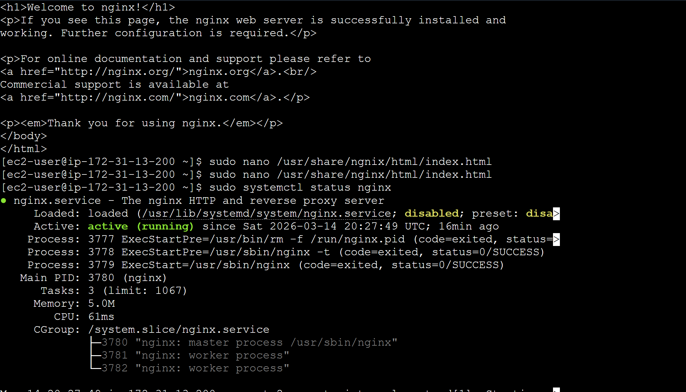
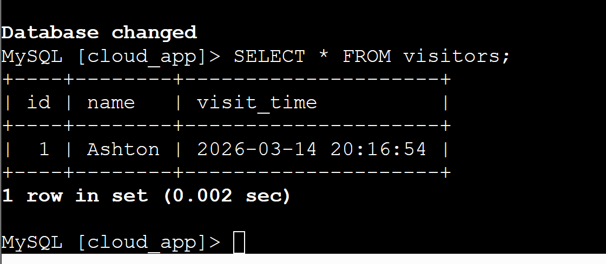

# EC2 NGINX Web Server + RDS Lab

## Project Overview
This project demonstrates how to deploy a Linux web server using NGINX on an AWS EC2 instance and connect it with a managed relational database using Amazon RDS.

The goal of this lab was to understand how cloud infrastructure components interact to host applications.

---

## Architecture
Components used in this project:

- Amazon EC2 (Linux instance)
- NGINX Web Server
- Amazon RDS Database
- Security Groups
- Public IP Access
- SSH Access

---

## What I Did
1. Launched an EC2 Linux instance
2. Connected using SSH
3. Installed and configured NGINX
4. Verified web server functionality using HTTP
5. Created an Amazon RDS database instance
6. Configured security groups for communication
7. Verified the web server was accessible via public IP

---
## Screenshots

### EC2 Instance Running


### HTTP Port 80 Responding


### RDS Database Query


### RDS Website

## Commands Used

Install NGINX

```bash
sudo yum update -y
sudo systemctl status nginx
sudo amazon-linux-extras install nginx1 -y
sudo systemctl start nginx
sudo systemctl enable nginx
